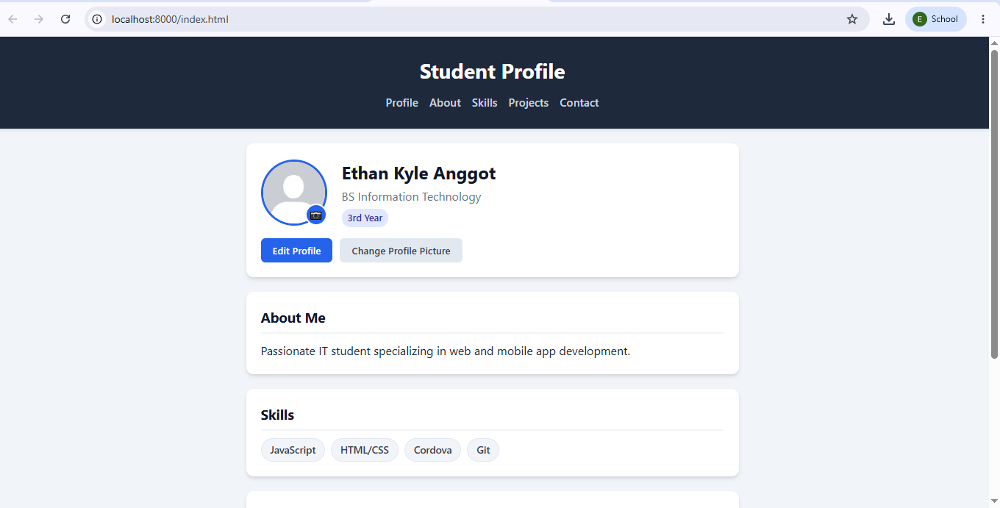
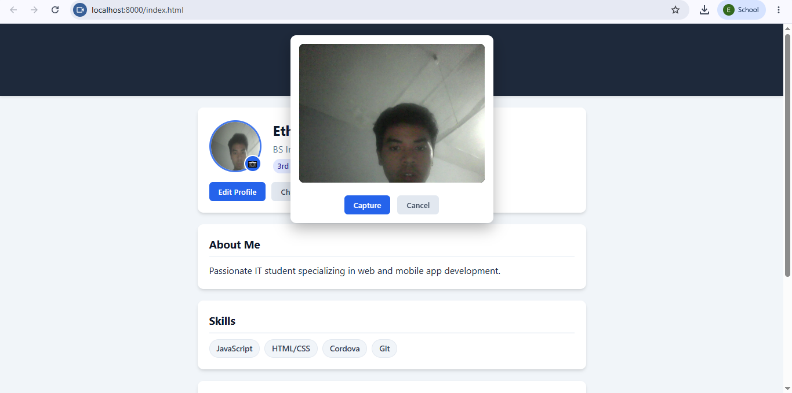
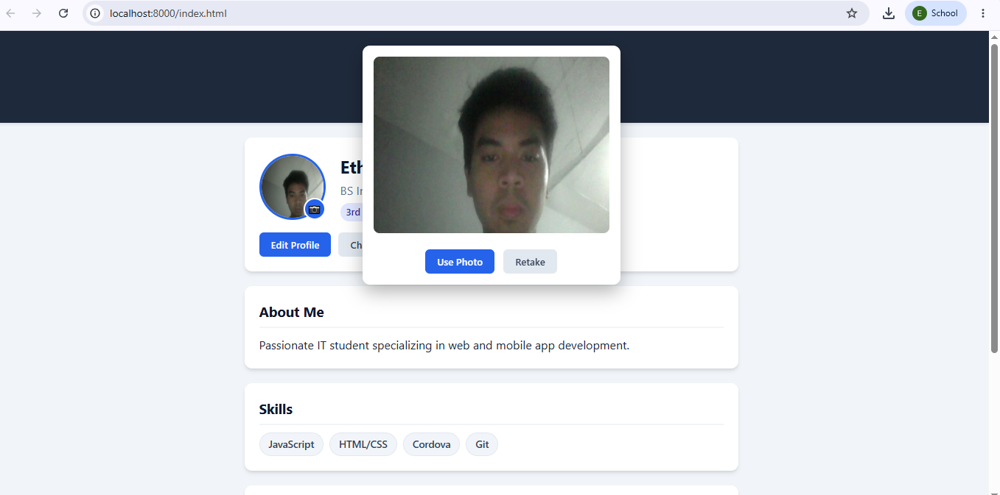
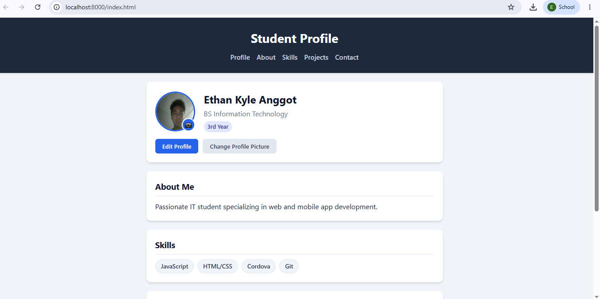

# Activity 6: Cordova Camera Plugin Integration
A hybrid mobile application built using Apache Cordova that allows users to view, edit, and update a student profile, complete with live camera photo capture functionality and local storage persistence.

# Features
## Profile Management: View and update student profile details including Name, Course, Year Level, About section, and Skills.

## Camera Integration: Capture profile pictures using the native device camera (or web preview modal for browser testing) with retake and confirmation capabilities.

## Data Persistence: Saves profile updates and avatar images locally using localStorage.

##Validation: Ensures all fields are filled before saving updates.

# Technical Stack
## Framework: Apache Cordova

## Frontend: HTML5, CSS3, JavaScript (ES6)

## Plugin: cordova-plugin-camera

# Project Structure
www/
├── css/
│   └── style.css        App styling and camera overlay positioning
├── js/
│   └── app.js           App logic, local storage, and camera integration
├── img/
│   └── avatar.png       Default avatar placeholder
└── index.html           Main application UI layout
screenshots/             Activity submission screenshots
config.xml               Cordova configuration file

# Getting Started
Prerequisites
Ensure you have the following installed on your machine:

Node.js (v14 or higher)

Apache Cordova CLI (npm install -g cordova)

Android Studio (for Android build/emulation)

# Installation & Setup
## Clone the repository:
git clone 
cd

## Add Cordova platforms:
cordova platform add android
cordova platform add browser

## Install required plugins:
cordova plugin add cordova-plugin-camera

## Run the application:

In Browser (Development Mode):
cordova run browser

On Android Device/Emulator:
cordova run android

# Submission Screenshots
All screenshots demonstrating completed features are stored in the screenshots/ directory:

activity-6-default.png - Initial student profile view.

activity-6-camera.png - Active webcam/camera stream interface.

activity-6-captured.png - Photo capture preview with Use Photo / Retake choices.

activity-6-updated.png - Updated profile displaying the new photo and saved changes.

# Developer Info
Student Name: Ethan Kyle Anggot

Course & Year: BS Information Technology - 3rd Year