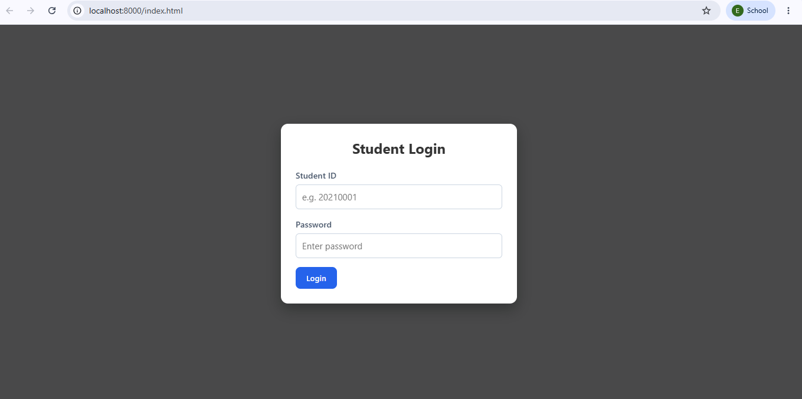
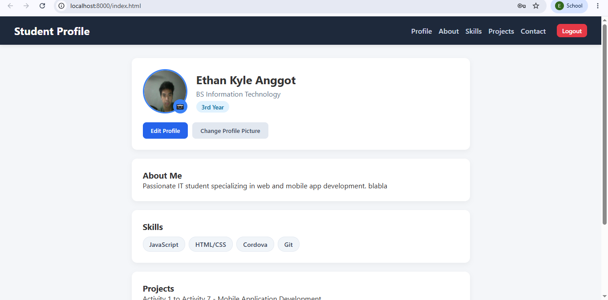
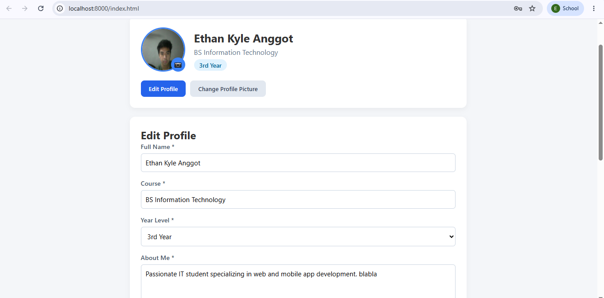
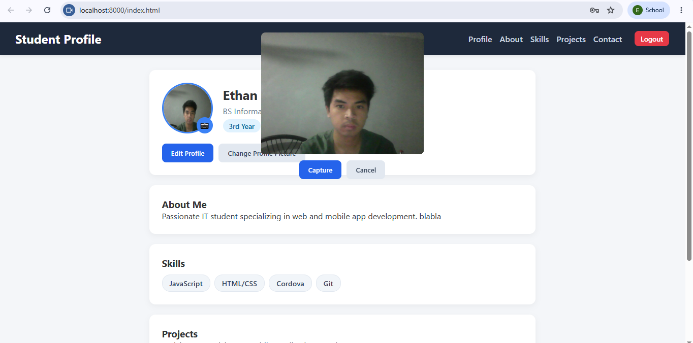

# Student Profile Mobile Application — Activity 7

A full-stack, database-driven mobile application built with **Apache Cordova**, **Node.js/Express**, and **SQLite3**. Originally starting as a static profile display, this application has evolved into a secure, full-stack enterprise mobile app with database persistence, JWT authentication, camera access, dynamic CRUD operations, and responsive styling.

---

## 1. Project Description
The Student Profile Application allows enrolled students to manage their academic profile directly from a cross-platform mobile interface. What began as a client-side prototype has evolved into a full-stack architecture where all student credentials, profile details, skills, and photos are stored in a persistent relational database (`SQLite3`). Access is restricted behind an authentication gateway, ensuring data isolation between students.

---

## 2. Application Pages & Sections

- **Login Modal**: Acts as the gatekeeper to the application, requiring a Student ID and Password before revealing protected routes.
- **Profile Page**: Displays primary student identity information, including full name, course, year level, bio, and profile picture.
- **About Section**: Highlights background information and personal bio details about the student.
- **Skills Section**: Renders an interactive list of technical and soft skills as visual chips.
- **Projects Section**: Displays current or completed coursework projects associated with the student.
- **Contact Section**: Features student contact pathways and location details.

---

## 3. Authentication
Users access their profile by supplying their **Student ID** and **Password** in the login screen.

### Authentication Flow
```text
Login Screen ──> Express Backend Authentication ──> JWT Generation ──> Protected Student Profile
```
The student submits their credentials via the Login Modal.

The Node.js server verifies the hashed password against the database record using bcryptjs.

Upon validation, the server generates a signed JSON Web Token (JWT).

The client saves the token to session storage and accesses their private Student Profile.

## 4. Student Profile Management
### Authenticated students can perform the following actions:

View Profile: View profile attributes loaded dynamically from the backend upon successful login.

Edit Information: Click Edit Profile to unlock input fields for Name, Course, Year Level, About, and Skills.

Save Changes: Submit edited fields via an HTTP PUT request to update database records permanently.

Update Profile Picture: Click the camera overlay icon to capture a new picture using the device camera or webcam canvas.

Log Out: Click Logout to clear the JWT session token, hide protected views, and return to the Login screen.

## 5. Database Integration
The system uses SQLite3 (database.sqlite) for reliable relational storage.

### Stored Student Information
1. Student ID (student_id - Unique Identifier)

2. Hashed Password (password - Security Credential)

3. Name (fullname)

4. Course (course)

5. Year Level (year_level)

6. About Me (about)

7. Skills (skills - Comma-separated or JSON list)

8. Profile Picture (avatar - Base64 image payload or reference string)

## 6. API / Backend Architecture
Communication between the Cordova frontend and the Express backend is handled via asynchronous REST API calls over HTTP (fetch).
```
Cordova Application (HTML/JS)
       │
       ▼ (HTTP REST API with Bearer Token)
Node.js / Express Backend
       │
       ▼ (SQL Queries)
SQLite Database (`database.sqlite`)
```
## 7. CRUD Operations
• Create: Automatically seeds/registers initial student accounts and profile records in SQLite upon backend initialization.

• Read: GET /api/profile retrieves authenticated student profile fields and renders them in the DOM.

• Update: PUT /api/profile receives modified text fields or new Base64 camera images and updates the database row.

• Delete: DELETE /api/profile (or administrative scripts) removes a designated test student record from the database.

## 8. Camera Integration
The camera functionality integrated in Activity 6 is fully retained:

Mobile Devices: Accesses the native camera hardware via the standard cordova-plugin-camera API.

Desktop Browsers: Uses a fallback HTML5 Canvas/Webcam stream modal to capture standard 400x400 photos.

Database Bridge: Captured photos are converted to Base64 JPEG strings and persisted directly to the SQLite avatar column.

## 9. Data Persistence
Profile modifications remain available across sessions because all state changes are saved server-side in database.sqlite on disk:

Closing or terminating the application

Restarting the device or browser window

Logging out and logging back in

The browser's localStorage holds only the temporary JWT authentication token—all actual student profile data is re-fetched straight from SQLite on every login.

## 10. Responsive Design
The app is styled using flexible layouts (CSS Flexbox, Grid, and media queries) to adapt to different display viewports:

Desktop: Centered card layout with fixed max-widths, clean padding, and side-by-side button alignments.

Tablet: Expanded form layouts and responsive flex grids for skills and navigation elements.

Mobile: Single-column vertical stacking, touch-friendly tap targets, and full-screen camera overlays.

## 11. Security Measures
Password Hashing: Passwords are encrypted using bcryptjs before database insertion—no plain text passwords are saved.

No Hardcoded Secrets: Sensitive configuration, such as JWT secret keys, are managed through backend environment setup.

Credential Protection: Database credentials and connection parameters are completely isolated on the server and never exposed to the client application.

Token Authorization: Backend endpoints require a valid Bearer <JWT_TOKEN> header; unauthenticated requests receive 401 Unauthorized.

## 12. How to Run
Prerequisites
Node.js (v14 or higher)

Apache Cordova CLI (npm install -g cordova)

### Steps to Execute
Start the Backend Server:
```
cd server
npm install
npm start
```
Run the Cordova Mobile Application:
Open a second terminal window in the project root:
```
cd <LastName>_StudentProfile
cordova run browser
```

## 13. Test Accounts
StudentID: 20210001

Password: password123

## 14. App Screenshots
## Login Page


## Student Profile


## Edit Profile


## Camera


## Updated Profile


